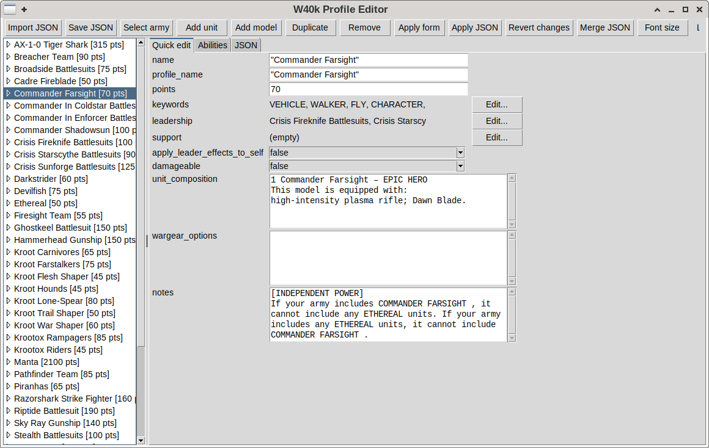
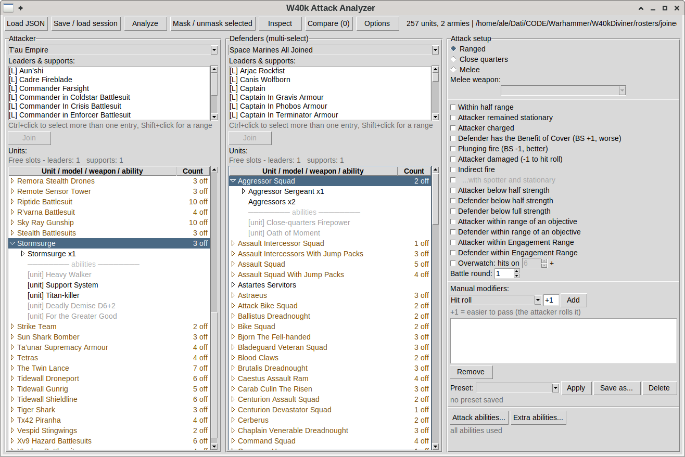
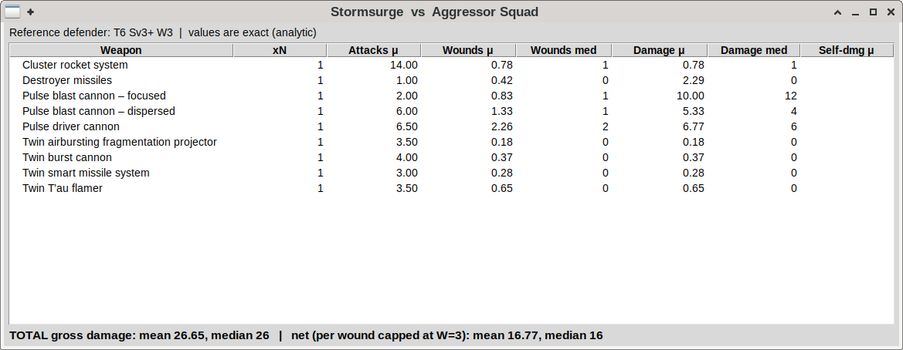
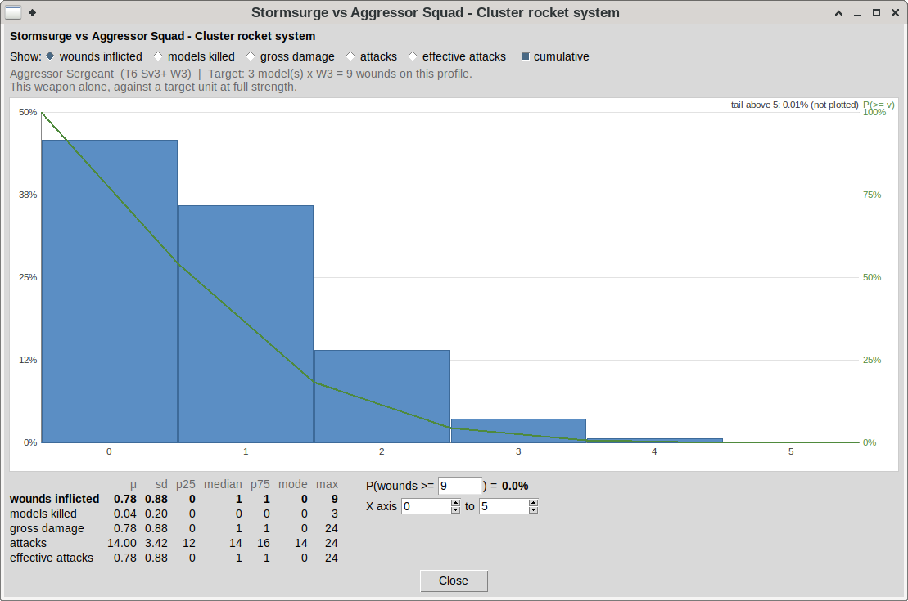
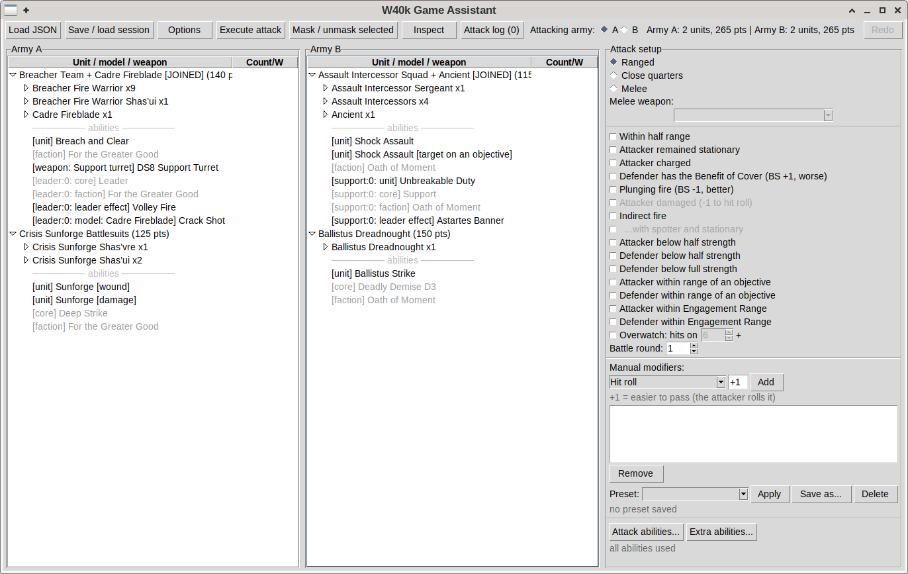

# W40kDiviner

A small suite of Python tools for **Warhammer 40,000 (11th edition)** that let
you build and edit army rosters, compute **exact** attack statistics (mean,
median) of one unit against another, and resolve attacks with real dice during a
game while tracking some variables.

I know that there are many such programs that do mostly the same, but this one
implements things a little differently from most programs out there that run
Monte-Carlo simulations.

All the math is **analytic**: the attack engine composes the exact probability
distribution of a shooting/fight sequence and reads medians/percentiles off the
exact CDF. No Monte Carlo is used except as a cross-check in the test suite.
**Why this? Because it's dramatically faster** than running 10000 random realizations
of the same attack and then taking the mean...

I hope it can be useful to the W40k community. Please contact me if you want to
collaborate. This program will (for sure) contain many bugs. Also there is dire
need of help in order to properly create the army rooster files. Even if you can
automatically populate stats, creating structured abilities from text descriptions
would need at least an LLM (and I wasted too much Claude AI resources on this
project to actually do this for all the armies...). So if you want to either
contribute to the code or even manually edit the roster files and share them, you
are welcome!


> **Companion tool.** Rosters are produced by
> [`ArmyFetcher/`](ArmyFetcher/README.md), a web scraper that turns the
> datasheets on Wahapedia / 40k.app into native JSON. See its own README.
> Please remember that Warhammer 40k is property of Games Workshop and you
> shouldn't use proprietary data without the owner's consent.
> Also Wahapedia and 40k.app may have policies preventing you from scraping
> their website for data. I take no responsibility over your use or abuse
> of this program.

---

## Contents

- [The three programs](#the-three-programs)
- [Requirements & install](#requirements--install)
- [Quick start](#quick-start)
- [The native JSON format](#the-native-json-format)
- [Program 1 — Profile Editor](#program-1--profile-editor)
  - [Ability reference — conditions & effects](#ability-reference--conditions--effects)
- [Program 2 — Attack Analyzer](#program-2--attack-analyzer)
- [Program 3 — Game Assistant](#program-3--game-assistant)
- [Loading rosters](#loading-rosters)
- [Common UI concepts](#common-ui-concepts)
- [Keyword configuration](#keyword-configuration)
- [Building Windows executables](#building-windows-executables)
- [Tests](#tests)
- [Project layout](#project-layout)
- [Disclaimer](#disclaimer)

---

## The three programs

| Program | File | Type | Purpose |
|---|---|---|---|
| **Profile Editor** | `profile_editor.py` | GUI | Create/edit army rosters, units, models, weapons and abilities; import & save native JSON; **join, rename and write out** whole armies (*Join / save*); **compare & selectively merge** a second roster (*Merge JSON*). |
| **Attack Analyzer** | `attack_analyzer.py` | GUI | Exact damage **distribution** (mean, median, percentiles, models killed) of one attacker vs one or more defenders, with full modifier context, audit trail, comparison between pinned analyses and CSV export. |
| **Game Assistant** | `game_assistant.py` | GUI | In-game attack resolution with real dice rolls; per-model wound tracking and masking, undo, assisted wound allocation and a log of the attacks of the game. |

All three share the same object model (`src/unit_model.py`), the same
modifier engine (`src/modifier_engine.py`), the leader/support attachment logic
(`src/leader_core.py`), and the keyword vocabularies in `src/keywords_config.json`.

---

## Requirements & install

- **Python 3.8+** with **Tkinter** (the standard-library GUI toolkit).
  - On most Linux distros Tkinter is a separate package, e.g.
    `sudo apt install python3-tk`.
  - On Windows/macOS the official python.org installers already include it.
- **No third-party packages** are needed to run the three programs — they use
  only the standard library.
  - `ArmyFetcher/` additionally needs `requests` and `beautifulsoup4`; see its
    own README.

No installation step is required: clone the repository and run the scripts
directly.

```bash
git clone <your-repo-url>.git
cd W40kDiviner
python3 profile_editor.py      # or attack_analyzer.py / game_assistant.py
```

---

## Quick start

1. **Get a roster.** Either use
   [`ArmyFetcher`](ArmyFetcher/README.md), or open the Profile Editor and build
   one by hand. Consider that ArmyFetcher create unit's abilities which have 
   only the description. You still must edit the JSON files by hand to properly 
   create the abilities.
2. *(Optional)* **Merge factions** into a single file from the load dialog of
   any of the three programs, so both armies of a game live in one JSON (see
   [Loading rosters](#loading-rosters)).
3. **Analyze** matchups before the game with the Attack Analyzer.
4. **Play** with the Game Assistant, which rolls the dice and helps you track wounds and other variables.

---

## The native JSON format

Schema tag: **`w40k-sim/6`**. This is the only format the GUIs and the engine
speak; it mirrors the object model 1:1 (`src/native_format.py`,
`src/unit_model.py`).

Top-level shape:

```json
{
  "format": "w40k-sim/6",
  "armies": [
    { "name": "Army/Faction name", "units": [ /* unit objects */ ] }
  ]
}
```

A **unit** carries its name, points, keywords, unit-scope abilities, the
leader/support relationships (`leadership` / `support` lists of unit names or
keywords it can attach to), `leader_effects` (abilities a leader/support applies
to the whole combined unit), and a list of **models**. Each model has its
characteristics (`M, T, Sv, W, LD, OC`, plus `invuln`, `fnp`), keywords,
abilities and **weapons** (`RNG, A, BS/WS, S, AP,
D, count`, keywords, abilities). `AP` follows the datasheet convention
(≤ 0). Characteristics may use dice notation (e.g. `"D6+1"`).

You normally never edit this JSON by hand — the Profile Editor exposes every
field.

---

## Program 1 — Profile Editor

**Run:** `python3 profile_editor.py`

A GUI to build and maintain rosters. The left pane is a tree
`army → units → models → weapons → abilities`; the right pane edits the selected
node.



**Workflow**

- **Import JSON / Save JSON** — load one or more native files, edit, save back
  (see [Loading rosters](#loading-rosters)). `Select army` switches between the
  armies of a multi-army document; `Join / save` reopens the join dialog on what
  is already loaded, so armies can be merged, renamed or written out after being
  edited. `Save JSON` writes straight back to the source file only while the
  document still *is* that file — after a join, a rename or a partial import it
  asks where to write, so the original is never truncated.
- **Tree navigation** — click a node to edit it. The editor supports two views
  of the selected node:
  - a **Quick edit** form for scalar fields (long-text fields such as
    `unit_composition`, `wargear_options` and `notes` become multi-line boxes);
  - a **JSON** view of the full node for anything the quick form doesn't cover.
- **Abilities** are edited through a dedicated ability editor
  (`src/ability_editor.py`) built on structured *effect/condition specs*
  (`src/effect_specs.py`, `src/condition_specs.py`) rather than free text, so
  they can be interpreted by the attack engine.
- **Copy/paste** of a model / weapon / ability node speeds up repetitive edits.
- **Keyword lists** are picked from the configured vocabularies
  (see [Keyword configuration](#keyword-configuration)).
- **Validation** (`src/validation.py`) flags structural problems before saving.

### Ability reference — conditions & effects

Each ability is a list of **conditions** (all must hold for it to apply) and a
single **effect**. Both are chosen from dropdowns in the ability editor and are
fully interpreted by the attack engine. No condition means that the ability
always apply. This section lists every entry available in those dropdowns and
its parameters.

Two cross-cutting notes:

- **Static vs dynamic conditions.** A condition decidable when the combat view
  is built (role, attack type, keywords, range, stationary, cover, …) gates the
  whole ability up front. A condition decidable only while rolling (a specific
  hit/wound/save value, critical, wound type) is compiled into the effect and
  honoured per die at roll time. You mix both freely; the engine sorts out when
  each is evaluated.
- **Who the ability affects.** Attacker-side effects modify *this unit's*
  attacks; defender-side effects (Feel no pain, Invulnerable save, both Damage
  effects, and the defensive half of *Ignore negative modifiers*) apply when
  *this unit is the target*. Use a **Profile role** condition when you need to
  pin an ability to one side explicitly.

#### Conditions
Those taking a *Who* parameter apply the check to the *Attacker* or the
*Defender*:

Standard conditions:

- **Profile role** — require this profile to be the *Attacker* or *Defender*.
- **Attack type** — restrict to *Melee* or *Ranged* attacks.
- **Range** — *within* or *beyond* half range.
- **Critical hit/wound** — require the hit or the wound to be a critical.
- **Attack step roll** — require a value on a chosen step (*Hit / Wound / Save*):
  a *specific / successful / failed* roll, on the *unmodified* or *modified* die,
  *or greater / or less / exactly*, versus a given value.
- **Attack characteristic** — compare an attack characteristic
  (*Strength / Attacks / AP / Damage*) against a value, on the *unmodified* or
  *modified* profile, with the usual comparison operators.
- **Remained stationary** — the *attacker* or the *defender* did not move.
- **Attacker charged** — the attacker charged this turn.
- **Keywords (only)** — require one or more keywords (comma-separated).
- **Keywords (excludes)** — exclude one or more keywords.
- **Wound type** — apply only to *Mortal* or *Normal* wounds.
- **Psychic attack** — the attacking weapon has the `PSYCHIC` keyword.
- **Target in cover** — the defender has the Benefit of Cover.
- **Below half strength** *(Who)* — the unit is Below Half-strength.
- **Below full strength** *(Who)* — the unit has lost at least one model.
- **Battle round** — compare the current battle-round number against a value.
  Set the round in the setup panel of either program (default `1`); with no
  panel involved — a script, a test — the round is unset and the condition
  reads as false.
- **Within objective range** *(Who)* — the unit is within range of an objective.
- **Leader attached** *(Who)* — the unit is being led (a CHARACTER is attached).
- **Within engagement range** *(Who)* — the unit is within Engagement Range of an
  enemy unit.

#### Effects

Standard effects:

- **Modify (relative)** — change a roll or characteristic by ±N. *Apply to* one
  of Hit/Wound/Save roll, BS, WS, AP, Damage, Attacks, Strength, M, LD, OC;
  *Operator* Add / Subtract / Improve by / Degrade by; then the value N.
- **Modify (absolute)** — set the chosen roll or characteristic to a new value.
- **Re-roll** — re-roll on Hit/Wound/Save/Damage: a *single* result, a *range*,
  or *all possible failures*, optionally limited to *once per phase*.
- **Override requirements** — set new success requirements for *Hit / Wound /
  Save*: *Always* or *Only*, optionally *on critical only* and/or *irrespective
  of modifiers*.
- **Generate extras** — extra *hits / attacks / wounds* per attack (amount N).
- **Increase weapon attacks** — change the weapon Attacks characteristic by ±N,
  optionally also applying to generated extra attacks.
- **Mortal wounds** — generate mortal wounds (N or dice notation), optionally
  *match weapon damage*, *end the attack sequence*, *no spill-over*, with an
  optional cap.
- **Feel no pain** *(defender)* — ignore each lost wound on a roll of N+.
- **Invulnerable save** *(defender)* — grant an invulnerable save of N+.
- **Damage modifier** *(defender)* — modify the Damage of each incoming attack.
  All Damage modifiers resolve in a **fixed order** regardless of how the
  abilities are declared: **(1) Set** fixes Damage to N → **(2) Multiply** by a
  factor, rounding **up** (`0.5` = halve) → **(3) Add** N (a classic “−1 damage”
  is *Add* with `-1`) → **(4)** the result is floored at **1**. Cumulative
  multipliers stack; among competing *Set* values the lowest wins.
- **Damage set to 0** *(defender)* — force each incoming attack's Damage to 0,
  **bypassing the floor at 1**. Applied after every other Damage modifier (the
  special case of step 4). No parameters.
- **Ignore negative modifiers to a roll** — ignore *negative* modifiers to the
  chosen roll (positive ones still apply). *Hit / Wound* act on this unit's
  attacks; *Save / Invuln / FNP* act when this unit defends.
- **Critical hit/wound on N+** — score a critical *hit* or *wound* on an
  unmodified N+ instead of 6 (best/lowest threshold wins).
- **Re-roll ONE die per activation** — if (*Hit / Wound / Damage*) are valid
  rerolls, a copy of the weapon for each option (all switched off) is placed on
  the unit: tick the one you want; *Allowance* says how the datasheet spends it
  (*one of any kind* vs *one of each kind*). The **Hit** and **Wound** versions
  are exact: every failed die of a roll is interchangeable, so re-rolling one is
  one more attack folded into the chain. The **Damage** version replaces a result
  instead of adding a die and is resolved by splitting on which attack spends the
  re-roll; it is exact for a weapon whose attacks deal damage once, and slightly
  **optimistic** when a single attack produces several damaging events via
  SUSTAINED HITS, EXTRA HITS or EXTRA WOUNDS — measured at +0.9% with SUSTAINED
  HITS 1 and +2.8% with SUSTAINED HITS 3. It is counted in the damage figures but
  **not** in *Inflicted* / *Kills*, which read slightly low; the analysis warns
  when that applies. On a flat Damage characteristic, or on a weapon that already
  re-rolls low Damage dice (a die may be re-rolled once), it does nothing and
  says so.
- **Special (core weapon ability)** — a core mechanic handled natively by the
  engine: Blast, Cleave, Extra attacks, Ignore cover, Lethal hits, Devastating
  wounds, Torrent, Twin-linked, Hazardous, Precision, Lance, Indirect fire, One
  shot, Pistol, Assault, Heavy.
- **Disable mechanic** — turn off a mechanic on the target: Invulnerable save,
  Re-roll hits, Re-roll wounds, Re-roll damage, or Save (including invulnerable).
- **Set keyword** — Add or Remove a keyword on *this weapon / all weapons / this
  model / all models / the unit* (parametric keywords take their value after the
  name, e.g. `SUSTAINED HITS 2`).

### Merge JSON — compare & selectively merge a second roster

*Merge JSON* reconciles the army you have open with a **second version of the
same army** coming from another file — the same faction re-scraped later, or the
40k.app vs Wahapedia export of the same datasheets. Differences flow **from the
second file into the one you have open**, one change at a time and entirely
under your control. Nothing is decided automatically.

- **Merge JSON** (toolbar) is **disabled until a file is loaded**, then enabled.
  It asks for the second JSON and compares the **currently selected army**
  against the army with the same name in that file; if the name is missing or
  ambiguous you choose which army to compare from a list.
- A dialog opens with a colour-coded, prefixed legend (colour-blind-safe
  Okabe-Ito palette, and a text prefix so it also reads without colour):
  `= identical`, `+ new`, `− removed`, `~ modified`.

The dialog has four boxes:

1. **Units** — every unit across both files. Select **new** (green) units and
   press **Merge selected** to copy them into your army; select **removed** (red)
   units and press **Delete selected** to drop them. Selecting a single
   **modified** (blue) unit fills the two detail boxes below.
2. **Stats / flags / keywords** — the selected unit's non-ability differences:
   unit/model/weapon characteristics, flags, per-keyword additions/removals, and
   whole models or weapons added/removed. Each row is accepted individually with
   **Accept selected** (single or multi-selection) or all at once with
   **Accept all**.
3. **Abilities** — the selected unit's ability differences (unit, model, weapon
   and leader abilities), at **whole-ability** granularity: added, removed, or
   replaced. Same **Accept selected / Accept all** controls.
4. **Differences of selected modified item** (read-only inspector) — click a
   modified row, chiefly a *replaced* ability, to see its **field-level**
   differences inside (e.g. `effect.data.value: 1 → 3`). It follows your **last
   click** across the two detail boxes.

Behaviour worth knowing:

- **Case-insensitive matching.** Names are matched ignoring letter case and
  surrounding spaces at **every level** (units, models, weapons, abilities), and
  keyword / free-text differences that are *only* capitalisation or spacing are
  not reported. The two sources capitalise differently (40k.app writes keywords
  in ALL-CAPS, Wahapedia in Title-case), so this keeps the diff free of hundreds
  of false positives — e.g. `Commander In Coldstar Battlesuit` and `Commander in
  Coldstar Battlesuit` are the same unit.
- **Ability ids** are ignored while diffing (they are random per file) and
  re-stamped for global uniqueness when the merge is committed; a replaced
  ability keeps the first id so any enable/disable toggle stays stable.
- **Staging.** Accepts, merges and deletes mutate an **in-memory working copy**
  and the diff refreshes live; the window stays open so you can work in several
  passes. **Finish** applies the merged army to the loaded data; **Cancel** (or
  closing the window) discards the whole session. As everywhere else in the
  editor, **Save JSON** is what writes to disk, and **Revert changes** still
  undoes an unsaved merge.

> A **rename** is not tracked: a unit (or model/weapon/ability) whose name
> genuinely changed between the two files shows up as one *removed* + one *new*,
> not as a modification.

---

## Program 2 — Attack Analyzer

**Run:** `python3 attack_analyzer.py`

Computes **exact** statistics for **one attacker unit vs one or more defender
units** (each defender opens its own result popup, so several can be compared
side by side).





**Panels.** Each army panel is split into a small **“Leaders & Supports”** list
and the **unit tree**:

- Selecting a **leader** greys out the units it cannot lead.
- With a leader and a compatible unit selected, **Join** creates the
  **combined unit** (shown as `[JOINED]` in the tree, with the
  shared abilities active). A separate **support** relationship is handled the
  same way — a unit can carry one leader **and** one support.
- Re-clicking a selected row **deselects** it. Selecting any child row
  selects its unit, so you never have to collapse the tree to pick a target.
- **Expanding a unit** shows its models, their weapons and its abilities.
  **Mask / unmask selected** switches a row off for the next analysis:
  a masked weapon is not fired (its count goes to `0`, and it is reported as
  skipped in the results), a masked ability has its `enabled` flag cleared.
  Unmasking restores the count the weapon *had*.
  Double-click the **Count** cell to type a weapon count by hand.
- Both changes apply to the session and travel with a saved session; neither
  is written back to the roster file.
- **Inspect** shows the full profile of the last selected unit, read-only,
  with **Save cheat sheet…** (see *Common UI concepts*).

**Running an analysis.** Pick the attacker and the defender(s), set the attack
context (see below), and press **Analyze**. The popup gives a **per-weapon**
damage breakdown plus totals, using the exact PMF/CDF — mean, median and
percentiles are all exact.

The **Effective** column is the number of attacks that ended up dealing damage,
i.e. that got past the save / invulnerable save **and** Feel No Pain.
**Inflicted** is the wounds actually taken off the unit (waste on a destroyed
model deducted) and **Kills** the models destroyed — both computed by the exact
allocation chain (`src/kill_chain.py`). The **totals row does not sum its columns**:
only means are additive (`src/result_rows.py` owns that distinction).
**Click a heading to change the statistic** it shows: μ → median → p25 → p75 →
μ. 
**Self-dmg** column appears only when a HAZARDOUS weapon is in the list.

A weapon fires into the unit the previous ones left behind, so the **order the
weapons fire in** changes how much damage is wasted and how soon the target
falls. When reordering is worth something the popup says so:

```
Firing order: frees 0.77 weapons - fire Cyclone missile launcher – krak ->
Assault cannon -> ...  (heuristic, not necessarily the best order)
```

The order is chosen to spend **fewer weapons** on the target — the ones still
loaded when it falls can be pointed somewhere else — with the wounds actually
removed breaking the ties. If that costs a fraction of a model killed the line
says so too. It is a heuristic over three candidate orders, not the optimum.

**In a result popup**

- **Distributions** — double-click any row for its distribution: a weapon row
  for that weapon alone, the **TOTAL** row for the whole unit combined. One
  gesture for both. The chart is a histogram with the cumulative curve
  `P(X ≥ v)` on top, the **Show** selector (wounds inflicted / models killed /
  gross damage, attacks, effective attacks) and an editable threshold `N`
  (default: the target's total wounds), plus the **X axis** controls described
  below — both sit to the right of the statistics table. Beside the chart sits a table with **every statistic of every
  series** — μ, sd, p25, median, p75, mode, max — so the window holds the whole
  result row, distributions and all; the row on the chart is shown in bold.
  Every unmasked weapon is summed into the TOTAL, mutually exclusive profiles
  (plasma standard *and* overcharge, alternative wargear) included: masking the
  ones you are not firing is deliberately left to the user, and the chart says
  so under it.
- **X axis _n_ to _m_** — the window the chart plots, both ends adjustable. It
  starts at 0 and the automatic cut (the 99.9th percentile); narrow it to spread
  the body of the distribution out, or raise the top to see the tail. Bars are
  hidden, never probability: the mass left out is annotated at the end it fell
  off (*below n* on the left, *tail above m* on the right) and the statistics
  keep describing the whole distribution. Unlike the threshold, neither end is
  remembered when you switch series — an axis that fits *models killed* says
  nothing about *gross damage* — so both reset to that series' own default each
  time. A floor above the ceiling collapses to it rather than drawing nothing.
- The result page **scrolls** when the window is too short for it, so it stays
  usable on a low-resolution screen.
- **Audit…** — what the engine *actually* used, in words: the hit and save
  numbers with every modifier that moved them, and an **Abilities in play**
  list. This is where you find the flag left on three analyses ago.
- **Add to compare** / **Compare (n)** — pin several analyses and compare
  them column by column, with deltas against the first pin, overlaid survival
  curves and a CSV export. A pin produced under different flags or modifiers is
  flagged `DIFFERENT`. Pins live for the session only.
- **Export CSV…** — the table exactly as shown.

**Attack context / modifiers** (via the setup panel, `src/setup_panel.py`):

- combat flags — half range, attacker stationary, attacker charged, defender in
  cover, and below-half / below-full-strength states for either side;
- **Indirect fire** — the shooting mode: only `INDIRECT FIRE` weapons fire, the
  target always counts as in Cover, hit re-rolls are lost and an unmodified
  roll below **6** always fails. The **spotter** tick relaxes that floor to
  **4**, but only together with **attacker stationary**, which the rules
  require on top of it. The two stay separate ticks — *stationary* also feeds
  `HEAVY` and the ability conditions, so ticking it as a side effect would
  misreport the attack — and a spotter ticked on its own draws the missing one
  in the warning colour;
- **Battle round** (a number, not a tick, default `1`) — the only context the
  combat maths never reads. It exists solely so an ability carrying the
  **Battle round** condition can be true; nothing else in the engine looks at
  it. No downloaded datasheet uses that condition — the rules keyed on the
  battle round live in Detachments and Stratagems, which are not on the
  datasheet — so the control is there for abilities you write yourself in the
  Profile Editor. It is recorded in the game assistant's attack log, so a
  post-mortem two turns later still knows which round it was;
- manual modifiers — per-roll modifiers (hit/wound/save/invuln/fnp), and
  characteristic modifiers on the weapon or on the attacker/defender model;
- **modifier presets** — a named set of manual modifiers, saved in the session
  file of either program. **Apply** *adds* a preset to what is already there
  (two presets are often active together) and skips entries already present;
  presets hold modifiers only, not the context flags;
- **Options** — session-wide caps (roll-modifier cap, re-roll cap) enforced by
  `src/rules_config.py`, and the global font scale (accessibility).

---

## Program 3 — Game Assistant

**Run:** `python3 game_assistant.py`

Resolves attacks with **real dice rolls** during a game.



**Workflow**

1. Load a JSON roster.
2. In the **Army setup** popup, pick the units of the two armies; running
   **points totals** are shown as you build each side.
3. During play, select an **attacker** unit and a **defender** unit in the two
   panels and press **Execute attack**. The attack window opens and takes you
   through the sequence one weapon at a time (below).

**Tracking aids**

- **Masking** — units, models, weapons (e.g. a `ONE SHOT` weapon) and
  **abilities** can be greyed out. A masked model or weapon is excluded from
  attack resolution; a masked ability row switches that ability off
  (`enabled: false` on the roster entry, so it stays off until unmasked).
  This lets you reflect casualties, spent one-use weapons and abilities
  already used or not in play. A model whose wounds reach **0** is masked for
  you, and a unit with nothing left standing has its own row masked so it
  cannot fight; both ride in the same undo step as the edit that caused them.
  Putting a model back is a deliberate gesture — raising the wounds again does
  not unmask it.
- **Wounds boxes** — each model row has an editable wounds box (double-click),
  initialised to `W × model count`, so you can track remaining wounds as the
  game goes on.
- **Undo / redo** — `Ctrl-Z`, `Ctrl-Shift-Z` (or `Ctrl-Y`), plus two buttons
  and the name of the action that will be undone. It covers the table edits:
  masking (a whole selection is **one** step) and the wounds/count cells. The
  history is cleared when a roster or a session is loaded, since the rows are
  rebuilt; it is not saved with the session.
- **Leaders/supports** attached to a unit are shown as one combined entry;
  masking uses a global model index and is split back to the correct part
  internally, so a joined unit tracks correctly.

**The attack window** — one weapon at a time, in the order the rules describe.
The left panel is the firing queue, the right one the defending unit split into
the **allocation groups** of the Save Rolls step (11th ed. 05.03): models with
the same profile together, attached CHARACTERs on their own.

- **Fire** rolls that weapon's attacks, hits and wounds and stops there, with
  the saves still to come. **Roll saves** resolves them against the model each
  attack is allocated to. **Fire all** runs the queue until something needs
  deciding, and says what.
- **Move up / Move down** sets the order groups and models take damage in, at
  any time before the saves are rolled. There is no “champion” flag in the
  profiles, so the Shas'ui is kept alive by moving it down the list. The order
  you set carries over to the next weapon.
- The queue itself can be reordered: a weapon fires into the unit the previous
  ones left behind, so the order changes how much damage is wasted.
- **PRECISION** lets you send a weapon's attacks to an attached CHARACTER; the
  window offers it and marks the group, the choice is yours.
- **Undo** takes back a whole activation, **dice included** — it is not a way
  to roll again until the dice fall better.
- **End sequence** writes every model whose wounds changed into the table as a
  single undo step, and records the attack in the log.

The arithmetic follows the same rules the analyzer's estimate is built on: one
event at a time capped by the wounds of the model it hits (three attacks of 2
damage are not one of 6), excess on a destroyed model wasted, the
already-wounded model first, and the pool resolved in order — ordinary wounds,
then `DEVASTATING WOUNDS`, then spilling mortal wounds one point at a time.

**HAZARDOUS** — the tests are rolled after the unit has resolved all of its
attacks, so a closing window opens when the attacking unit owes anything. It
shows which weapons failed and where the mortal wounds land; they spill across
the whole unit like any other mortal wound, and you can point a weapon's wounds
at a model of your choice. **Skip** leaves the table alone — the log records
what was owed either way.

**Attack log** — every resolved attack is recorded: who fired at whom, under
which flags and modifiers, with what each weapon rolled event by event. The
window shows one row per attack over the detail of the selected one, or the
running totals per defending unit when nothing is selected. `New turn` groups
the entries, mis-clicked attacks can be deleted, and the whole log exports as
text or CSV. It is saved with the session, so reopening a session mid-game does
not lose it. The totals are damage **rolled**, not wounds removed: overkill on a
destroyed model is not subtracted. Damage a unit did to itself with HAZARDOUS is
recorded separately.

---

## Loading rosters

All three GUIs load rosters the same way, in two steps.

**1. Choose the files.** `Load JSON` (`Import JSON` in the editor) opens the
picker: the folder on the left, the files chosen for loading on the right.
A click selects a file, a second click deselects it — no modifier key — and
the list on the right **survives changing folder**, so a selection can be
assembled from several places. `System dialog…` falls back to the platform's
own file dialog and *adds* what it returns, for network locations or a name
typed by hand.

**2. Choose the armies.** When the files hold more than one army, the load
dialog lists them all and offers two ways of combining them:

- **Join into one** merges the selected armies into a **single new army** under
  a name you choose. Units whose names collide across sources are suffixed with
  their source army (`pippo` from `pluto` and from `topolino` → `pippo_pluto`,
  `pippo_topolino`) so both survive with a traceable origin. The originals leave
  the list and the result takes their place, so joins can be chained.
- **Save selected** writes the selected armies to one file, each keeping its own
  identity — two or more of them make a **multi-army file**. Ability ids are
  re-stamped on the way out, so ids that were only unique per source file stay
  unique in the result. The window stays open, so one session can write several
  files. *(Profile Editor only; the same dialog is reachable later through
  `Join / save`.)*
- **Rename** fixes a name. Both joins reject **duplicate army names**, and so
  does saving: a warning appears as soon as two selected armies share one.
- **Open / Import** takes the selected armies into the program.

Armies are listed **as they are on disk**: two files that both carry
`Space Marines` are two armies, and what to do about it is your call rather
than a silent merge.

---

## Common UI concepts

- **Search** — list widgets across the GUIs support incremental search
  (`src/search_widget.py`).
- **Selecting several entries** — most lists use `Ctrl+click` (`Cmd` on macOS)
  and `Shift+click` for a range; the label under each says which. The roster
  picker and the army list are the exception: a click selects, a second click
  deselects, so a subset can be picked with the mouse alone.
- **Tooltips** — hovering a button shows one line saying what it does and what
  it acts on. Buttons whose caption already is the explanation (`OK`, `Cancel`,
  `Close`) have none.
- **Inspect** — full-profile view of a unit (`src/inspect_dialog.py`),
  read-only in both programs: abilities and weapon counts are switched off by
  masking a row of the program's own table (the unit tree in the Analyzer, the
  model table in the Game Assistant), which is one gesture instead of two.
- **Cheat sheet** — `Save cheat sheet…` in the Inspect window writes a
  printable one-page version of the unit *as the program will play it*: stat
  lines, weapon tables, abilities, leader included. HTML by default (opens in
  any browser, `Ctrl-P` gives a clean page) or plain text when the file name
  ends in `.txt`. Dice characteristics are printed as the datasheet writes them
  (`A D6`), never rolled, and a **disabled ability is printed as `[OFF]`**
  rather than dropped — an ability missing from the sheet would be invisible.
- **Options** — one dialog in all three programs: the global font scale
  (accessibility) plus, in the Analyzer and the Game Assistant, the modifier
  and re-roll caps, set once per session and applied to every calculation.

---

## Keyword configuration

`keywords_config.json` holds the **unit / model / weapon keyword vocabularies**
(WH40k 11th ed. core rules + dataset). It is loaded automatically at startup and
is **editable**.
This is used only for keywords matching and validation, the code still has
hardcoded mechanics for for many of the keywords listed here.

- Parametric weapon keywords (`SUSTAINED HITS`, `RAPID FIRE`, `MELTA`, `ANTI`, `CLEAVE`)
  take a value typed after the name, e.g. `SUSTAINED HITS 2`.
- If the file is missing or malformed the programs still start, with empty
  vocabularies.

---

## Building Windows executables

`W40kDiviner.spec` is a **PyInstaller** spec that builds three self-contained
one-file executables (Python and all dependencies embedded):

```
ProfileEditor.exe    AttackAnalyzer.exe    GameAssistant.exe
```

Build (on Windows, from the `W40kDiviner` folder):

```bat
pip install pyinstaller
pyinstaller W40kDiviner.spec
```

Executables land in `dist/`, one `.exe` each with no shared folder between them.

A one-file build unpacks itself into a temporary folder that is deleted on exit,
so nothing you are meant to touch can live inside it. Two things are looked for
**next to the executable**:

- `rosters/` — your roster `.json` files. It is also the folder the load dialog
  opens in by default.
- `keywords_config.json` — optional. The shipped copy is embedded; one placed
  next to the `.exe` takes precedence.

UPX is disabled on purpose (compressed one-file bootloaders trip some antivirus
heuristics).

Please consider that I do now have a PC with windows, so this section is totally
untested and I just made the .spec file with Claude AI just for your convenience.
:-)

---

## Tests

A GUI-free (headless) test harness lives in `tests/`. See
[`tests/README.md`](tests/README.md). The tests exercise the engine without a
display: leader/support attachment, masking, the damage pipeline, the allocation
rules, the pure half of every new UI feature, and the dialog logic.

```bash
cd tests && python3 run_all.py          # the whole suite (~2 min)
python3 test_regress.py                 # digest against the saved baseline
```

They run on a **synthetic roster** shipped with the tests, so no ArmyFetcher
output is needed; `--real_data` switches the data-dependent ones to your own
rosters.

**Tkinter is optional.** It ships with most Pythons but is a build option, and a
slim container or a distribution without `python3-tk` has none. `tests/tkstub.py`
is an in-memory stand-in — a Treeview that keeps a real item tree, an Entry with
a real buffer, bindings that can be fired by hand — installed by
`tkstub.install_if_missing()` **only when the real toolkit is absent**, and it
says so on stdout when it steps in, so a green run can never quietly mean *green
against a fake*. What it does not cover: a machine that has Tkinter but no
display, where `import tkinter` succeeds and `Tk()` then raises `TclError`. That
failure is left visible on purpose.

---

## Project layout

```
W40kDiviner/
├── profile_editor.py        # Program 1 (GUI)
├── attack_analyzer.py       # Program 2 (GUI)
├── game_assistant.py        # Program 3 (GUI)
├── W40kDiviner.spec          # PyInstaller build spec (Windows)
├── src/                     # shared engine + UI modules
│   ├── native_format.py     #   native JSON schema (w40k-sim/6) I/O + migration
│   ├── unit_model.py        #   object model (units/models/weapons/abilities)
│   ├── attack_math.py       #   exact attack PMF/CDF mathematics
│   ├── attack_resolve.py    #   dice-roll resolution (game assistant)
│   ├── analyzer_core.py     #   glue: object model → attack maths
│   ├── modifier_engine.py   #   context flags & modifier application
│   ├── leader_core.py       #   leader/support attachment + masking
│   ├── kill_chain.py        #   exact models-killed / wounds-inflicted chain
│   ├── dist_stats.py        #   percentiles, P(X >= N), histogram binning
│   ├── result_rows.py       #   result table rows + CSV (pure)
│   ├── comparison.py        #   pinned analyses, comparison matrix, CSV
│   ├── audit.py             #   per-weapon audit trail formatting
│   ├── mod_presets.py       #   named sets of manual modifiers
│   ├── unit_mask.py         #   what a unit-tree row is, and what masking does
│   ├── unit_tree.py         #   the analyzer's unit tree widget
│   ├── app_paths.py         #   where the program's files are (frozen or not)
│   ├── roster_picker_core.py #  file picker state: folders + basket (pure)
│   ├── roster_picker.py     #   the roster file picker window
│   ├── army_load_core.py    #   join / rename / save of loaded armies (pure)
│   ├── army_load_dialog.py  #   the load / join / save dialog
│   ├── attack_log.py        #   game log of the attacks resolved (pure)
│   ├── log_view.py          #   attack-log window
│   ├── undo_stack.py        #   undo/redo history of the table edits (pure)
│   ├── alloc_groups.py      #   Save Rolls allocation groups & order (pure)
│   ├── attack_session.py    #   the weapon-by-weapon attack sequence (pure)
│   ├── session_rows.py      #   what the attack window shows, as data (pure)
│   ├── attack_session_view.py  # the attack window
│   ├── defender_models.py   #   table rows ↔ combat view join (pure)
│   ├── hazard_close.py      #   the HAZARDOUS closing step (pure)
│   ├── hazard_view.py       #   the HAZARDOUS closing window
│   ├── cheat_sheet.py       #   printable one-page unit sheet (text + HTML)
│   ├── dist_view.py         #   histogram / survival-curve canvases
│   ├── tree_ids.py          #   game assistant table row-id grammar (pure)
│   ├── rules_config.py      #   session-wide caps, battle-round range
│   ├── ui_prefs.py          #   session-wide interface preferences (pure)
│   ├── keywords_config.py   #   keyword vocabulary loader
│   ├── ability_editor.py    #   structured ability editor
│   ├── profile_diff.py      #   diff / selective-merge logic (pure; Merge JSON)
│   ├── merge_dialog.py      #   Merge JSON dialog (four-box diff & merge UI)
│   ├── effect_specs.py / condition_specs.py / spec_*.py
│   ├── editor_widgets.py / setup_panel.py / search_widget.py / ui_utils.py
│   └── … (see the folder for the full module list)
├── tests/                   # headless test harness (see tests/README.md)
└── ArmyFetcher/             # roster scraper (see ArmyFetcher/README.md)
```

---

## Disclaimer

Warhammer 40,000 and all associated names, marks and datasheet content are
trademarks of **Games Workshop Ltd.** This is an **unofficial, non-commercial
fan tool** and is not endorsed by or affiliated with Games Workshop. Roster data
scraped from third-party sites is the property of its respective owners; use it
in accordance with those sites’ terms.

---

Claude Opus 5.0 (Anthropic) was used extensively in the writing of this code.
